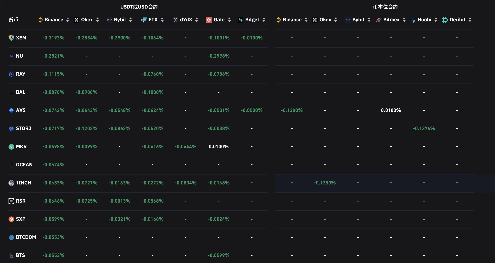

# Quantitative Trading on Cryptocurrency

Different quantitative strategies on the cryptocurrency, where has been verified with real trading.

Cholian (Chao Li)

cholianli970518 dot gmail dot com

> This is a free version with limited features. If you want to implement it in your real account, please contact the author.

# Table of content
* [Introduction](#introduction)
* [Open an account](#open-an-account)
    * [Binance](#biance)
    
* Strategies

    * [EMA strategy](./strategies/ema/readme.md)
    * [Funding rate strategy](#funding-rate-strategy)

    * Cross-exchange arbitrage strategy (updating)
    * ARIMA-based volatility modelling strategy (updating)
    * GJR-GARCH-based multiple tokens strategies (updating)
    * [LSTM-based multiple tokens strategy](#lstm)
    * [Simple RNN-strategy](#rnn)
    * Attentions-based trend signals identification (updating)

* [Useful link and website for cryptocurrency](#useful-link-and-website-for-cryptocurrency)

## Introduction

**Exchange**: [Binance](https://www.binance.com/en)

**API**: [Binance API](https://binance-docs.github.io/apidocs/spot/en/)

## Open an account

### Binance

[Open an account in Binance](https://accounts.binance.com/en/register)


# Strategy comparison

| Strategy | Risk       | Sharp ratio | Annual return | Maximum Drawdown |
| -------- | ---------- | ----------- | ------------- | ---------------- |
| EMA      | Long-Short | 3.56        | 77.36%        | 11.71%           |
|          |            |             |               |                  |
|          |            |             |               |                  |
|          |            |             |               |                  |

## Funding rate strategy

> What is the Funding rate?

Funding rates are periodic payments either to traders that are long or short based on the difference between perpetual contract markets and spot prices. Therefore, depending on open positions, traders will either pay or receive funding...... [Read more](https://www.binance.com/en/blog/futures/a-beginners-guide-to-funding-rates-421499824684900382)

> How to make an strategy with funding rate?

Funding rates on Binance are collected every hour and we can see that some crypto assets have reached more than 1% a day. Essentially anyone who is short on the DEFI-USDT contract will be collecting 0.3714% every eight hours to hold that position.......[Read more](https://jamesbachini.com/futures-funding-rate-strategy/)



data: [coinglass](https://www.coinglass.com/zh/FundingRate)


> What is the daily return or annual return could be?

Given an example with the XEMUSDT (fundingrate: -0.3193%)

| Term | Calculation | Profit | Note|
| ----------- | ----------- | ----------- | ----------- |
|Funding rate yield | 0.3193%*3 | + 0.9579% | Three collection on funding rate for a day|
| Transaction fee | 0.02% * 2 * 3 | -0.12% | Buy and sell for each collection|
|95% confidence price change| 0.08% * 3 | -0.24% |The price of certain trading pair will fluctuate between [-0.053, 0.0253], with 5% significant level|
| Daily profit | - | 0.5979%|
| Annual return | (1.005979)^{365} | 8.8096|

Theoretically, it could achieve a very high return.

> About this strategy

Before the funding collection time point, selecting the highest funding rate pair, then opening a long / short position according to the negative / positive funding rate.

After the funding rate collection finished, closing the current position.

> Strategy parameters

```python
KEY = 'your API KEY'
SECRET = 'your API SECRET'
```

Follow the [official instruction](https://www.binance.com/en/support/faq/360002502072) to create a pair of Binance API key and secret.

```python
leverage = 3
```

The maximum amount of [Leverage](https://www.binance.com/en/support/faq/360033162192) available depends on the notional value of your position—the larger the position, the lower the leverage.

```python
trading_amount = 300 # e.g 100 -> $100
```

`Total size` = `trading_amount` * `entry Price` * `leverage`

```python
funding_rate_bound = 0.0020
```
The minimum absolute funding rate. e.g: `abs(-0.3193%)>0.002`, if there is no pair satisfied the minimum funding rate bound, nothing will be executed during this strategy.

```python
advance_time = 1
lag_time = 15
```
Given an example:

7:59:00 Open a position [MARKET order](https://www.binance.com/en/support/faq/360033779452)

(1 minute)

8:00:00 Funding rate collection

8:01:00 Close the position with a [LIMIT order](https://www.binance.com/en/support/faq/360033779452)

(15 minutes)

8:16:00 If the [LIMIT order](https://www.binance.com/en/support/faq/360033779452) is not executed, then execute a [MARKET order](https://www.binance.com/en/support/faq/360033779452) for stopping loss of holding position.

note: [LIMIT order](https://www.binance.com/en/support/faq/360033779452) will have lower commission fee than [MARKET order](https://www.binance.com/en/support/faq/360033779452)


> Real trading implementation

7:59:55 Filtering the token with maximum funding rate (threshold: `t = 0.2%`)

7:59:58 Open a position [MARKET order](https://www.binance.com/en/support/faq/360033779452) according to the positive or negative funding rate.

(1 minute)

8:00:00 Funding rate collection

8:00:00:01 Detecting if received the funding fate.

.... 

every 0.1 second for one detection.

....

8:00:07:08 Received the funding fate, close the position immediately with [MARKET order](https://www.binance.com/en/support/faq/360033779452)


> How to run the strategy

```bash
python Funding_rate_trading_update_20210121.py
```

## RNN

-----RNN----- 

```
MAE test set 37056.61 

MSE test set 1447203315.52 

MAPE test set 0.7784 
```

-----drift(Benchmark)----- 

```
MAE test set 1126.46 

MSE test set 2409500.28 

MAPE test set 0.0239
```

## LSTM

```
MAE: 0.0375
```


# Useful link and website for cryptocurrency

## Exchange

[CoinBase](https://www.coinbase.com/)

[Binance](https://www.binance.com/)

[Okx/Okex](https://www.okx.com/)

[Bybit](https://www.bybit.com/)

## APIs

[Binance API](https://binance-docs.github.io/apidocs/spot/en/#change-log)

[OKEX v3](https://www.okx.com/docs/en/)

[OKEX v5](https://www.okx.com/docs-v5/en/)

[cryptopanic](https://cryptopanic.com/developers/api/)

## Quant on Cryptocurrency

* [FMZ square](https://www.fmz.com/square)

* [比特币布道者](http://btc.mom/)


## News

* [CoinDesk](https://www.coindesk.com/)

* [Defistation](https://www.defistation.io/)

* [BSCSACN](https://bscscan.com/)

* [YieldWatch](https://www.yieldwatch.net/)

* [CoinMarketCap](https://coinmarketcap.com/)

* [CoinGlass](https://www.coinglass.com/)

* [Bitcoin News](https://news.bitcoin.com/about-bitcoin-news/)*

* [律动](https://www.theblockbeats.info/)

## On-time news

[cryptopanic](https://cryptopanic.com/)

## Crypto wallet

[Metamask](https://metamask.io/)


