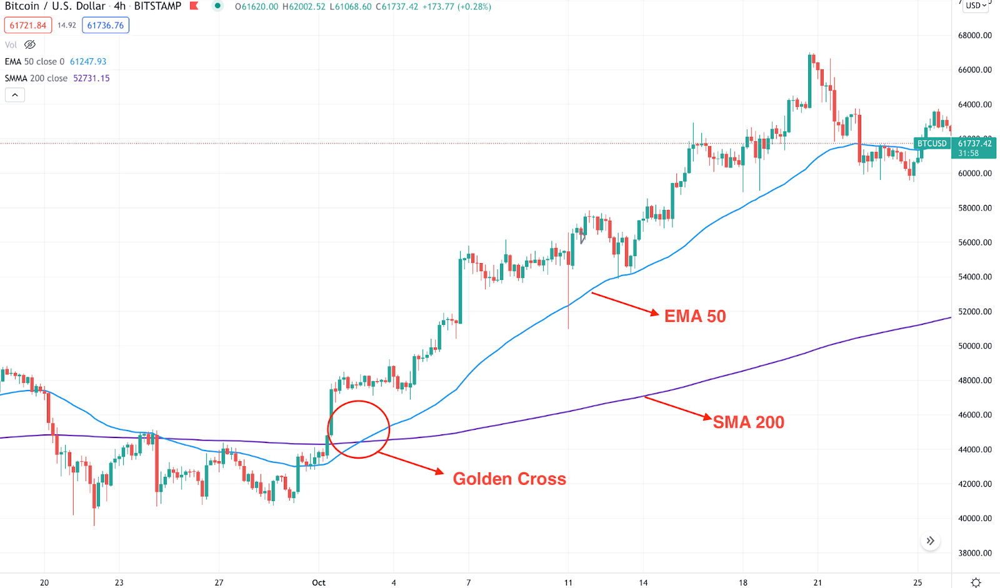
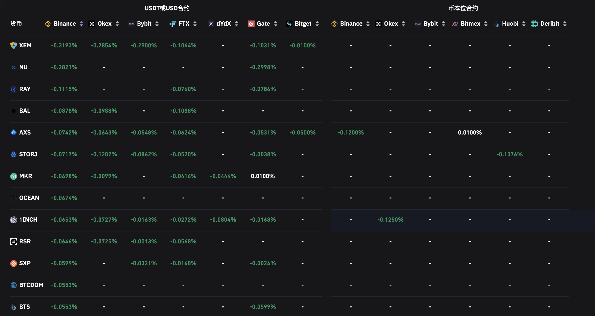

# Quantitative trading on Cryptocurrency

Author: Cholian (Chao Li)

Emial: cholianli970518@gmail.com

## All the code is just <span style="color:red"> a free version </span> with basic function, but <span style="color:yellow">still can be run and...make a profit</span>

<span style="color:red">If you want the completed code, please contact with me</span>.

# Table of Contents
* [Introduction](#introduction)
* [Open an account](#open-an-account)

    * [Binance]()

* Strategies

    * [EMA strategy](#ema)
    * [Funding rate strategy](#funding-rate-strategy)

    * ARIMA based arbitrage strategy (updating)

## Introduction

Different quantitative strategies on the cryptocurrency, where has been verified with real trading.

**Exchange**: [Binance](https://www.binance.com/en)

**API**: [Binance API](https://binance-docs.github.io/apidocs/spot/en/)
## Open an account

### Binance
Click: [Open an account in Binance](https://accounts.binance.com/en/register)

## EMA strategy


Reference: https://learn.bybit.com/trading/exponential-moving-average-ema-crypto/

> **What is the EMA strategy?**

An exponential moving average is a technical indicator that gives greater weighting to recent prices in its calculation. As a result, EMA responds more quickly to the latest price changes, as compared to a simple moving average (SMA), which has a bigger lag.... [Read more](https://learn.bybit.com/trading/exponential-moving-average-ema-crypto/)

> **How to build a quantitative strategy with EMA?**

When one moving average moves above another, it creates a profitable trading opportunity. One of the most effective crossover strategies is known as the golden cross. When the 50 EMA moves above the 200 SMA, it indicates that short-term bulls are becoming more aggressive, while long-term traders are still bullish....[Read more](https://learn.bybit.com/trading/exponential-moving-average-ema-crypto/)


Reference: https://learn.bybit.com/trading/exponential-moving-average-ema-crypto/

> Strategy parameters

```
symbol = 'BTCUSDT'
```
This is the trading symbol.

```
quantity = 0.037 
```
This is the trading quantity.

Trading notional value = Market price * quantity.

```
interval = '6h'
```
This is the trading based frequency, for more frequency, please refer to the [Binance API doc](https://binance-docs.github.io/apidocs/spot/en/#change-log)

```
ema_a_period = 36
ema_b_period = 60
```
ema_a refers to the faster line while ema_b refer to the slow line.

> Run the strategy

Create the Binance API key and Secret in [Link](https://www.binance.com/en/support/faq/360002502072)

```
KEY = 'your API KEY'
SECRET = 'your API SECRET'
```
Then,
```
python Binance_EMA_trading_update_20220114.py
```
> Backtesting parameters

| Parameter | Description |
| ----------- | ----------- |
| Backtesting framework | [Backtrader](https://www.backtrader.com) |
| Trading pair | [BTCUSDT-Perpetual future contract](https://www.binance.com/en/futures/BTCUSDT) |
| Data frequency | 6h|
| Training set | 2019-09-08 17:59:59 - 2021-04-25 23:59:59 |
| Test set | 2021-04-26 05:59:59 - 2021-12-31 17:59:59|
| Starting Cash | $100|
| Leverage | X1|
| Commission | 0.04%|


> Backtesting result: 

```
Sharp Ratio: 3.56
Final return（2021-04-26 - 2021-12-31）：77.36%
Maximum Drawdown： 11.71%
......
```

## Funding rate strategy

> What is the Funding rate?

Funding rates are periodic payments either to traders that are long or short based on the difference between perpetual contract markets and spot prices. Therefore, depending on open positions, traders will either pay or receive funding...... [Read more](https://www.binance.com/en/blog/futures/a-beginners-guide-to-funding-rates-421499824684900382)

> How to make an strategy with funding rate?

Funding rates on Binance are collected every hour and we can see that some crypto assets have reached more than 1% a day. Essentially anyone who is short on the DEFI-USDT contract will be collecting 0.3714% every eight hours to hold that position.......[Read more](https://jamesbachini.com/futures-funding-rate-strategy/)


data: [coinglass](https://www.coinglass.com/zh/FundingRate)


> What is the daily return or annual return could be?

Given an example with the XEMUSDT (fundingrate: -0.3193%)

| Term | Calculation | Profit | Note|
| ----------- | ----------- | ----------- | ----------- |
|Funding rate yield: | 0.3193%*3 | + 0.9579% | Three collection on funding rate for a day|
| Transaction fee: | 0.02% * 2 * 3 | -0.12% | Buy and sell for each collection|
|95% confidence price change| 0.08% * 3 | -0.24% |The price of certain trading pair will fluctuate between [-0.053, 0.0253], with 5% significant level|
| Daily profit | - | 0.5979%|
| Annual return | (1.005979)^{365} | 8.8096|

Theoretically, it could achieve a very high return.

> About this strategy

Before the funding collection time point, selecting the highest funding rate pair, then opening a long / short position according to the negative / positive funding rate.

After the funding rate collection finished, closing the current position.

> Strategy parameters

```
KEY = 'your API KEY'
SECRET = 'your API SECRET'
```
Create the Binance API key and Secret in [Link](https://www.binance.com/en/support/faq/360002502072)

```
leverage = 3
```

The maximum amount of [Leverage](https://www.binance.com/en/support/faq/360033162192) available depends on the notional value of your position—the larger the position, the lower the leverage.

```
trading_amount = 300 # e.g 100 -> $100
```
`Total size` = `trading_amount` * `entry Price` * `leverage`

```
funding_rate_bound = 0.0020
```
The minimum absolute funding rate. e.g: `abs(-0.3193%)>0.002`, if there is no pair satisfied the minimum funding rate bound, nothing will be executed during this strategy.

```
advance_time = 1
lag_time = 15
```
Given an example:

7:59:00 Open a position [MARKET order](https://www.binance.com/en/support/faq/360033779452)

(1 minute)

8:00:00 Funding rate collection 

8:01:00 Close the position with a [LIMIT order](https://www.binance.com/en/support/faq/360033779452)

(15 minutes)

8:16:00 If the [LIMIT order](https://www.binance.com/en/support/faq/360033779452) is not executed, then execute a [MARKET order](https://www.binance.com/en/support/faq/360033779452) for stopping loss of holding position.

note: [LIMIT order](https://www.binance.com/en/support/faq/360033779452) will have lower commission fee than [MARKET order](https://www.binance.com/en/support/faq/360033779452)

> How to run the strategy

```
python Funding_rate_trading_update_20210121.py
```

