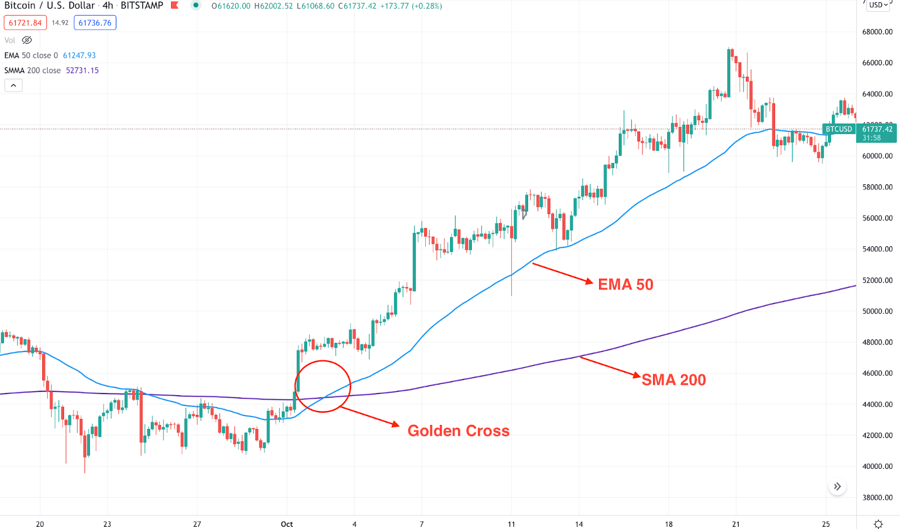
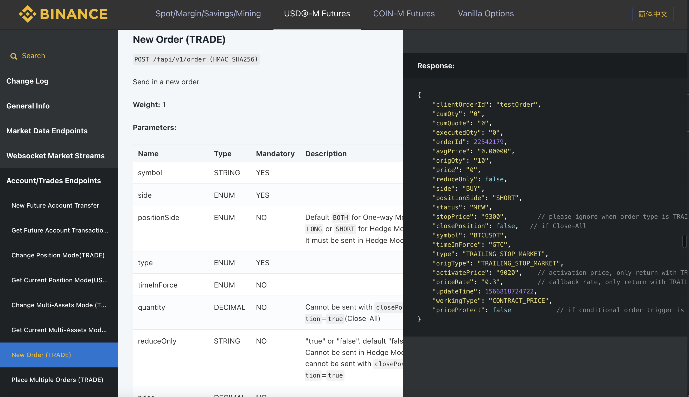
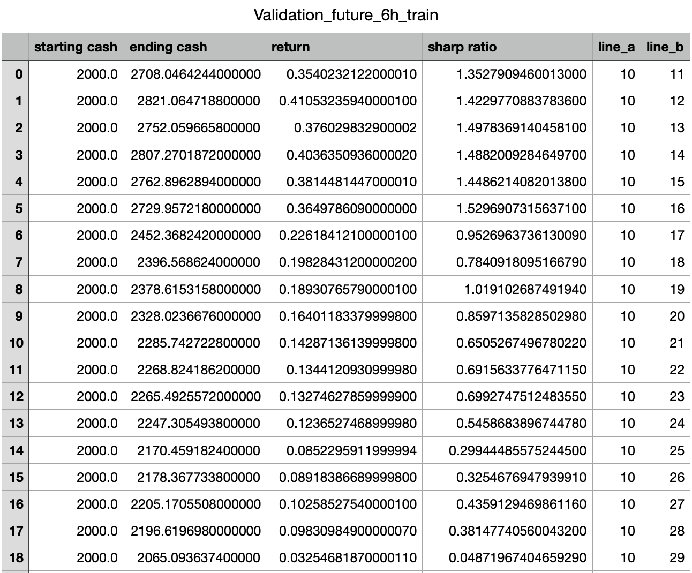
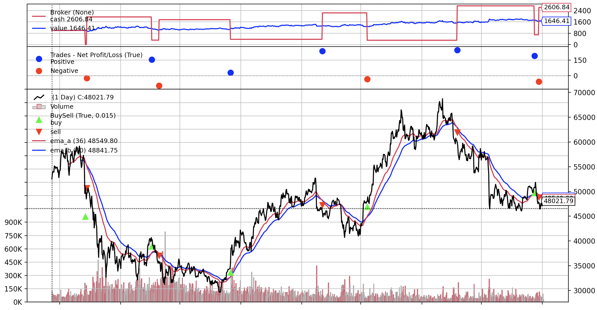
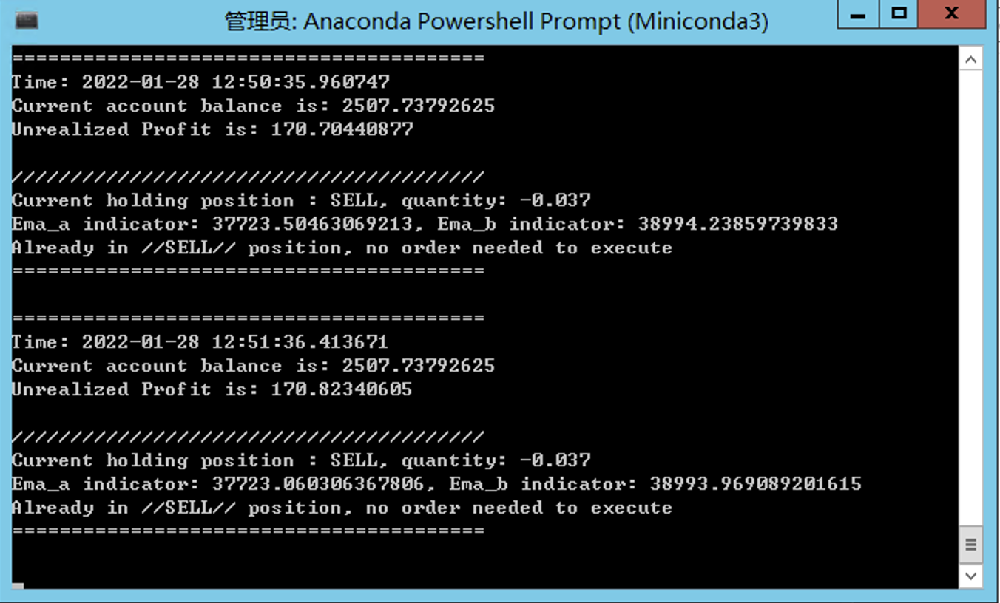

[TOC]

# Introduction:

Author: Cholian

Email: cholianli970518@gamil.com

# Strategy

## What is the EMA strategy?

An exponential moving average is a technical indicator that gives greater weighting to recent prices in its calculation. As a result, EMA responds more quickly to the latest price changes, as compared to a simple moving average (SMA), which has a bigger lag.... [Read more](https://learn.bybit.com/trading/exponential-moving-average-ema-crypto/)

## How to build a quantitative strategy with EMA?

When one moving average moves above another, it creates a profitable trading opportunity. One of the most effective crossover strategies is known as the golden cross. When the 50 EMA moves above the 200 SMA, it indicates that short-term bulls are becoming more aggressive, while long-term traders are still bullish....[Read more](https://learn.bybit.com/trading/exponential-moving-average-ema-crypto/)



## How to capture the trend of cryptocurrency (BTCUSDT)?


By capturing the trend of the current markets, we can do the following things:

* Identifying the current market emotion

* Predicting the future market price

* Doing an indicator for the overall crypto market, as the market capflow of BTC takes over 80% of the whole market.

* Building some long term quantitative trading strategies

* Exploring the hidden relationship between different cryptocurrencies. For example, it can be grouped together with similar market position, where price of ETH is highly correlated to the price of BTC.

* Evaluating the effectiveness of some technicals in the crypto market

## Model Comparison


| | MA | <font color = 'red'>EMA</font> | Holt-winter | LSTM |
| ---- | ----------- | ----------- | ----------- | ----------- | 
| Character | simple, lagging | more sensitive to the new data | useful for seasonal data | advanced skills for previous signal like human brian|

# EMA

## Data collection

Build my own API toolboxes from the [Binance APIs](https://binance-docs.github.io/apidocs/spot/en/).



Toolbox examples:

```
def exchangeInfo():
    BASE_URL = 'https://fapi.binance.com'
    PATH = '/fapi/v1/exchangeInfo'
    
    url = urljoin(BASE_URL, PATH)
    
    response = requests.get(url)

    data = response.json()
    data = pd.DataFrame(data['symbols'])
    return data
```

## Trading market selection

| | Spot | Future | <font color = 'red'>Perpetual swap </font>| Option |
| ---- | ----------- | ----------- | ----------- | ----------- | 
| Character | No margin and leverage, one direction | Long and short position, expiry date | Perpetual future contract, long/short position | B-S model formula backing up |


| | ETH/Lite/AXS | DOGE/SHIT/CAT | <font color = 'red'>BTC</font>| 
| ---- | ----------- | ----------- | ----------- |
| Character | Following the BTC | High volatility | Largest market capflows|

It is `BTCUSDT perpetual future contract`

## Backtesting

| Parameter | Description |
| ----------- | ----------- |
| Backtesting framework | [Backtrader](https://www.backtrader.com) |
| Trading pair | [BTCUSDT-Perpetual future contract](https://www.binance.com/en/futures/BTCUSDT) |
| Data frequency | 6h|
| Training set | 2019-09-08 17:59:59 - 2021-04-25 23:59:59 |
| Test set | 2021-04-26 05:59:59 - 2021-12-31 17:59:59|
| Starting Cash | $100|
| Leverage | X1|
| Commission | 0.04%|

**Training set backtesting**


## Grid Validation

To finding the most appropriate EMA parameter, grid validation is done from `10` to `99`. The assessment criterions are `Sharp ratio` and `Final return` between `minute-frequency` data to `day-frequency` data. 

The partial sample validation result is as following:



Finally, the fast line is `36` and the slow is `60`.

## Backtesing on test data

Test set backtesting (36,60)

From `2021-04-26 05:59:59` To `2021-12-31 17:59:59`

From `$1000` to `$1646`



## Strategy measurements

```
Sharp Ratio: 3.56
Final return（2021-04-26 - 2021-12-31）：77.36%
Maximum Drawdown： 11.71%
......
```

# Run strategy

## Strategy parameters

```python
symbol = 'BTCUSDT' # trading symbol
quantity = 0.037 # trading quantity
# Trading notional value = Market price * quantity.
interval = '6h' # trading based frequency, for more frequency, please refer to the [Binance API doc](https://binance-docs.github.io/apidocs/spot/en/#change-log)
ema_a_period = 36 # ema_a refers to the faster line
ema_b_period = 60 # while ema_b refer to the slow line.
```

## Run the strategy

Follow the [official instruction](https://www.binance.com/en/support/faq/360002502072) to create a pair of Binance API key and secret.

```python
KEY = 'your API KEY'
SECRET = 'your API SECRET'
```

Then execute the script with:

```bash
python Binance_EMA_trading_update_20220114.py
```

## Real trading implementation

Server: `Tencent`

Location: `Hong Kong, China`

Systerm: `Windows Server 2012 R2`

Envirment: `Miniconda`

Language: `Python`



# Reference

Reference: https://learn.bybit.com/trading/exponential-moving-average-ema-crypto/
