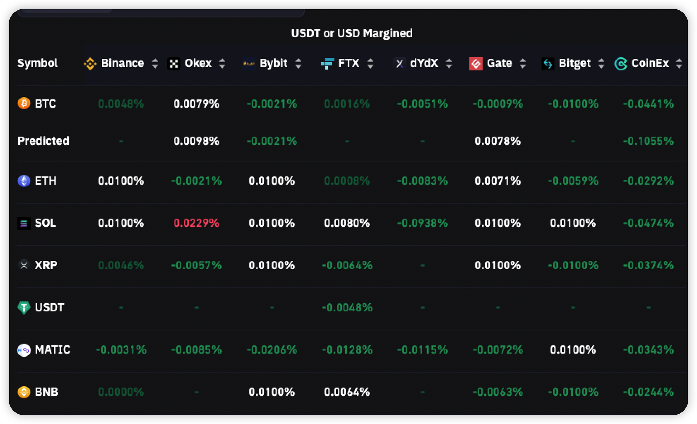
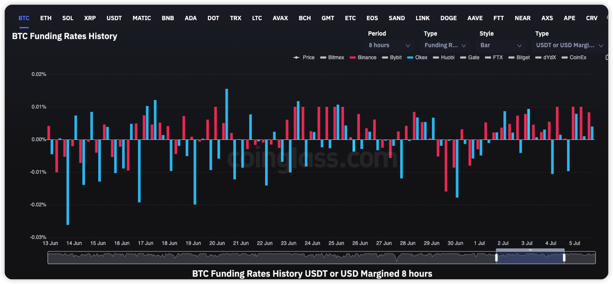
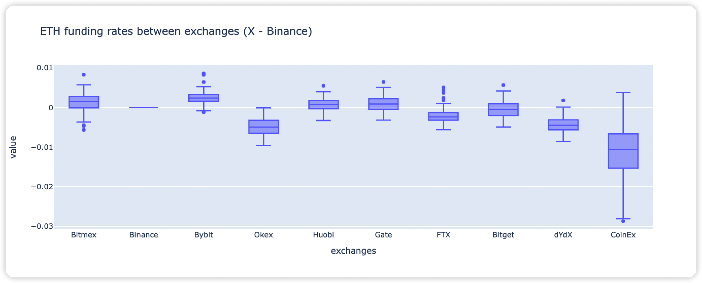
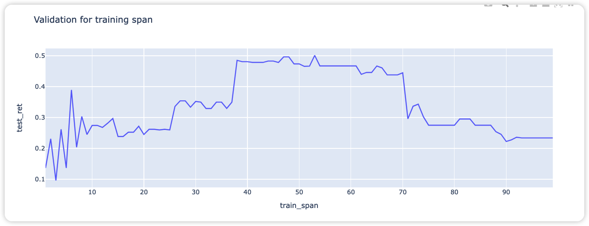
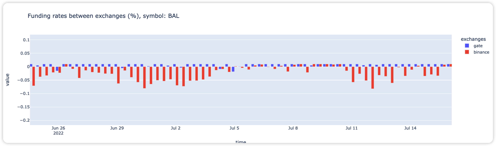

[TOC]

# Introduction

This strategy is a risk-free arbitrage based on the difference of funding rate over difference exchanges

Author: Chao Li

Contact: cholianli970518@gmail.com

# Strategy

## What is the funding rate?

Funding rates are periodic payments either to traders that are long or short based on the difference between perpetual contract markets and spot prices. Therefore, depending on open positions, traders will either pay or receive funding. 

[Funding rate](https://www.binance.com/en/blog/futures/a-beginners-guide-to-funding-rates-421499824684900382)

## Why there will be a arbitrage opportunity of funding rate?

According to the market inefficiency, there will be a spread gap between exchanges. 

For example, here is the screenshot for  the funding rate over different exchanges,

Source: [Coinglass](https://www.coinglass.com/FundingRate)

Although the BTCUSDT perpetual future has the most liquidity, there will be an unstable funding rate gap over exchanges, like the following comparison over `Binance` and `Okx`

Source: [Coinglass](https://www.coinglass.com/funding/BTC)

## How possible will there be a arbitrage opportunity?

Take a better example of `ETHUSDT (perpetual future)`, here is the statistical result for the ETHUSDT PERP funding rate over exchanges.

>  ETHUSDT(Perpetual future) fundingrate over exchanges table

|           | **Bitmex** | **Binance** | **Bybit** | **Okex** | **Huobi** | **Gate** | **FTX** | **Bitget** | **dYdX** | **CoinEx** |
| --------- | ---------- | ----------- | --------- | -------- | --------- | -------- | ------- | ---------- | -------- | ---------- |
| **count** | 543.0      | 543.0       | 543.0     | 543.0    | 543.0     | 543.0    | 543.0   | 543.0      | 543.0    | 218.0      |
| **mean**  | 0.0031     | 0.0022      | 0.0042    | -0.0032  | 0.0027    | 0.0029   | 0.0001  | 0.0019     | -0.0018  | -0.0111    |
| **std**   | 0.0143     | 0.0092      | 0.0089    | 0.0143   | 0.0079    | 0.0108   | 0.0093  | 0.0096     | 0.0139   | 0.0302     |
| **min**   | -0.0989    | -0.0798     | -0.0462   | -0.1299  | -0.0697   | -0.0729  | -0.0376 | -0.01      | -0.058   | -0.1213    |
| **25%**   | 0.0015     | -0.0033     | 0.0009    | -0.0114  | -0.0018   | -0.0017  | -0.0056 | -0.01      | -0.0087  | -0.0315    |
| **50%**   | 0.01       | 0.0052      | 0.01      | -0.0024  | 0.0041    | 0.01     | 0.0     | 0.01       | -0.0006  | -0.0089    |
| **75%**   | 0.01       | 0.01        | 0.01      | 0.0058   | 0.01      | 0.01     | 0.004   | 0.01       | 0.0074   | 0.0096     |
| **max**   | 0.01       | 0.01        | 0.01      | 0.0344   | 0.01      | 0.01     | 0.1072  | 0.01       | 0.0504   | 0.0761     |

Source: Coinglass, time: 2022-01-17 00:00:00 to 2022-07-16 16:00:00, unit: %

Taking the `Binance` as the benchmark, we can calculate the difference compared with that in `Binance`, and we got the following table:

> ETHUSDT(Perpetual future) fundingrate compared with Binance

|           | **Bitmex** | **Binance** | **Bybit** | **Okex** | **Huobi** | **Gate** | **FTX** | **Bitget** | **dYdX** | **CoinEx** |
| --------- | ---------- | ----------- | --------- | -------- | --------- | -------- | ------- | ---------- | -------- | ---------- |
| **count** | 543.0      | 543.0       | 543.0     | 543.0    | 543.0     | 543.0    | 543.0   | 543.0      | 543.0    | 218.0      |
| **mean**  | 0.0008     | 0.0         | 0.002     | -0.0054  | 0.0005    | 0.0007   | -0.0021 | -0.0003    | -0.004   | -0.0122    |
| **std**   | 0.0168     | 0.0         | 0.0107    | 0.015    | 0.0102    | 0.012    | 0.0111  | 0.0127     | 0.0131   | 0.0314     |
| **min**   | -0.1021    | 0.0         | -0.0354   | -0.1012  | -0.041    | -0.0505  | -0.0212 | -0.02      | -0.0528  | -0.0926    |
| **25%**   | -0.0017    | 0.0         | -0.0002   | -0.0146  | -0.0053   | -0.0033  | -0.0076 | -0.0097    | -0.0115  | -0.0318    |
| **50%**   | 0.0        | 0.0         | 0.0001    | -0.0053  | 0.0       | 0.0      | -0.0031 | 0.0        | -0.0037  | -0.0117    |
| **75%**   | 0.0096     | 0.0         | 0.0066    | 0.0044   | 0.0051    | 0.0068   | 0.0019  | 0.0062     | 0.0037   | 0.0062     |
| **max**   | 0.0898     | 0.0         | 0.0898    | 0.0609   | 0.0824    | 0.0528   | 0.1478  | 0.0805     | 0.0771   | 0.0896     |

Source: Coinglass, time: 2022-01-17 00:00:00 to 2022-07-16 16:00:00, unit: %

**Did you see that?** 

There will be `0.0054%` risk-free return for each funding rate collection as long as we take the opposite position over these two exchanges.

## How is the return?

Simply, let us assume the arbitrage strategy over `Bybit` and `Okex` on `ETHUSDT PERP`:

Here is the holding information:

|                       | Binance               | OKex(Okx)            |
| --------------------- | --------------------- | -------------------- |
| Trading pair          | ETHUSDT PERP          | ETHUSDT PERP         |
| Average fundingrate   | 0.0022%               | -0.0032%             |
| Holding position      | Short                 | Long                 |
| Leverage              | 1                     | 1                    |
| Commision fee (Taker) | 0.04%                 | 0.05%                |
| Holding time          | 1 year                | 1 year               |
| Daily return          | 0.0066% (0.0022% * 3) | 0.0096% (0.0032 * 3) |

Here is the profit table, if we hold this strategy:

| Term             | Value    | Calculation              |
| ---------------- | -------- | ------------------------ |
| Daily return     | 0.0162%  | 0.0066%  + 0.0096%       |
| Annual return    | 6.1%     | (1+0.0162*0.01)**365 - 1 |
| Risk position    | Natural  |                          |
| Commision fee    | 0.09%    |                          |
| **Final return** | **5.2%** | **6.1% - 0.09%**         |

It looks like a small return, right?

Actually, **REMEMBER we did not use leverage yet**!

**For 1X leverage, we have 5.2% risk-free return, for 10X leverage, we will have 52% risk-free**

## How should we implement this startegy in real account

### Stratgey 1 Single token arbitrage

Simply say, we select a token and take the profit of the spread gap over two exchanges. Thus, it is important to select a stable and profitable token, because:

1. A token with a large marketcap will have smaller price volatility to avoid the risk of margin volatility
2. A token with a big funding rate spread gap will have a better annual return and less leverage required

### Strategy 2 Multiple token arbitrage

For each a certain period, we select the token with the highest funding rate spread over a week or a month, then we hold the arbitrage like the strategy for a few days, then after a few days, we take another asset again.

One of the advantages of this strategy is less leverage needed. Given a simple example, here is a validation plot for test data return. And let me explain it in detail, 

`train_span` : How long should we use to select a token, e.g we use past `30` funding collections to select which coin has the biggest expected funding rate spread over `Binance` and `Gate`.

`test_ret` : The annual return for each training span. 

Here is the funding rate comparison of  `BALUSDT PERP` over `Binance` and `Gate` 

# Api link:

> Coinglass

https://coinglass.github.io/API-Reference/#general-info

> Gate

https://www.gate.io/docs/apiv4/en/#futures-insurance-balance-history

> Binance

https://binance-docs.github.io/apidocs/futures/en/#mark-price
