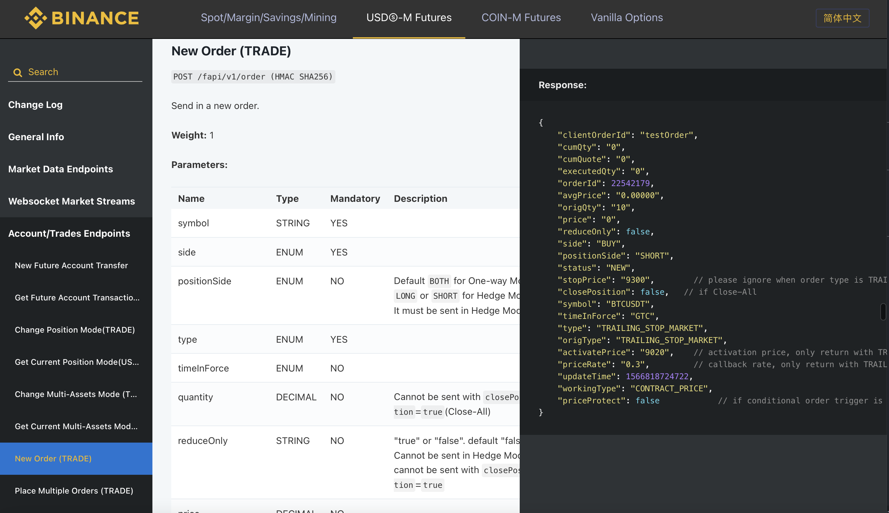
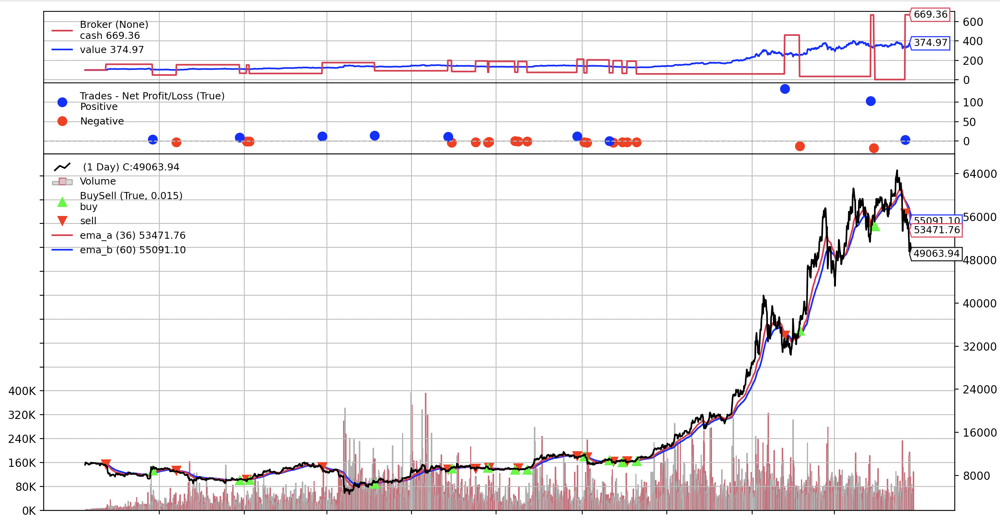
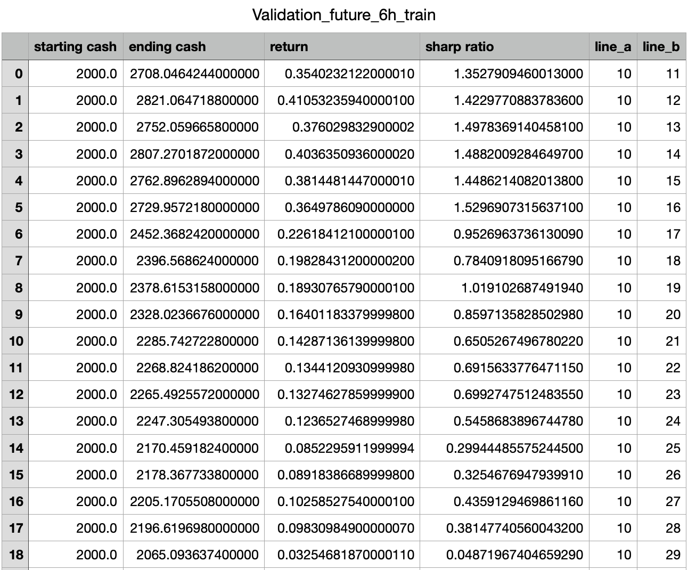
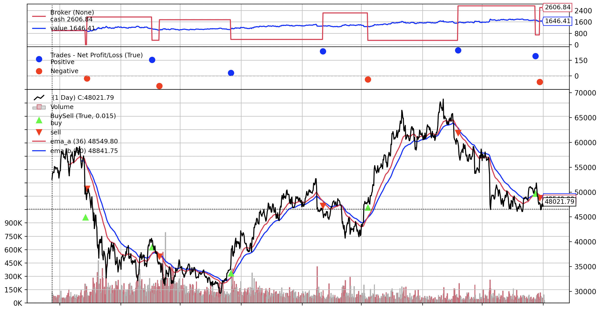
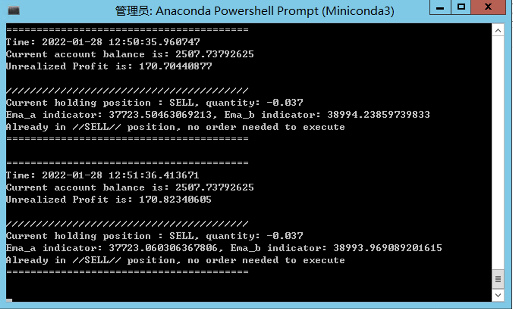

# Abstract:
Author: Cholian
> Question: How to capture the trend of cryptocurrency (BTCUSDT)?


By capturing the trend of the current markets, we can do the following things:

* Identifying the current market emotion

* Predicting the future market price

* Doing an indicator for the overall crypto market, as the market capflow of BTC takes over 80% of the whole market.

* Building some long term quantitative trading strategies

* Exploring the hidden relationship between different cryptocurrencies. For example, it can be grouped together with similar market position, where price of ETH is highly correlated to the price of BTC.

* Evaluating the effectiveness of some technicals in the crypto market


> Model assumption


| | MA | <font color = 'red'>EMA</font> | Holt-winter | LSTM |
| ---- | ----------- | ----------- | ----------- | ----------- | 
| Character | simple, lagging | more sensitive to the new data | useful for seasonal data | advanced skills for previous signal like human brian|

# EMA

> Data collection

Build my own API toolboxes from the [Binance APIs](https://binance-docs.github.io/apidocs/spot/en/).



Toolbox examples:

```
def exchangeInfo():
    BASE_URL = 'https://fapi.binance.com'
    PATH = '/fapi/v1/exchangeInfo'
    
    url = urljoin(BASE_URL, PATH)
    
    response = requests.get(url)

    data = response.json()
    data = pd.DataFrame(data['symbols'])
    return data
```

> Trading market selection

| | Spot | Future | <font color = 'red'>Perpetual swap </font>| Option |
| ---- | ----------- | ----------- | ----------- | ----------- | 
| Character | No margin and leverage, one direction | Long and short position, expiry date | Perpetual future contract, long/short position | B-S model formula backing up |


| | ETH/Lite/AXS | DOGE/SHIT/CAT | <font color = 'red'>BTC</font>| 
| ---- | ----------- | ----------- | ----------- |
| Character | Following the BTC | High volatility | Largest market capflows|

It is `BTCUSDT perpetual future contract`

> Backtesting

| Parameter | Description |
| ----------- | ----------- |
| Backtesting framework | [Backtrader](https://www.backtrader.com) |
| Trading pair | [BTCUSDT-Perpetual future contract](https://www.binance.com/en/futures/BTCUSDT) |
| Data frequency | 6h|
| Training set | 2019-09-08 17:59:59 - 2021-04-25 23:59:59 |
| Test set | 2021-04-26 05:59:59 - 2021-12-31 17:59:59|
| Starting Cash | $100|
| Leverage | X1|
| Commission | 0.04%|

* Training set backtesting




> Grid Validation

To finding the most appropriate EMA parameter, grid validation is done from `10` to `99`. The assessment criterions are `Sharp ratio` and `Final return` between `minute-frequency` data to `day-frequency` data. 

The partial sample validation result is as following:



Finally, the fast line is `36` and the slow is `60`.

> Backtesing on test data

* Test set backtesting (36,60)

From `2021-04-26 05:59:59` To `2021-12-31 17:59:59`

From `$1000` to `$1646`



> Real trading implementation

Server: `Tencent`

Location: `Hong Kong, China`

Systerm: `Windows Server 2012 R2`

Envirment: `Miniconda`

Language: `Python`



